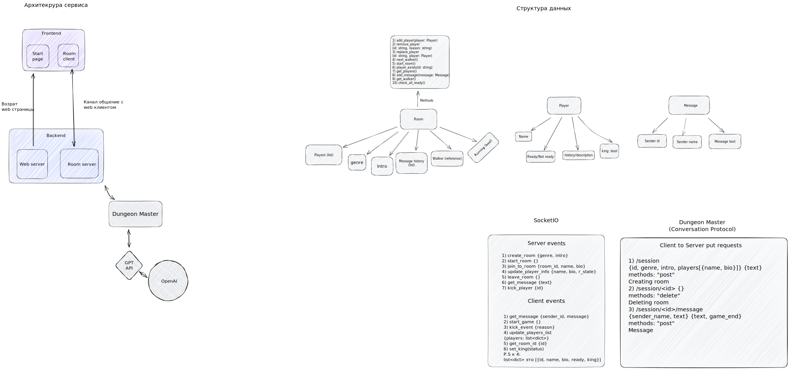

# GoToDungeon
This service is anlog of AIDungeon with game party component.
GoToDungeon designed for russian a community, but in a future we will support others.

### Prehistory:
This project was developed at the [GoToCamp](https://goto.msk.ru/) field school.

### Service architecture:

### Launch service tutorial:
- Clone repository (command: `git clone https://github.com/DenisIndenbom/GoToDungeon.git`)
- Change directory (command: `cd GoToDungeon`)
- Create files `.env` in the folders *DungeonMaster*, *RoomServer*, *Web* and fill them as in the files `.env_example`
- Exectute command: `docker-compose build`
- Exectute command: `docker-compose up`

### Stop service tutorial:
- Go to service directory
- Exectute command: `docker-compose down` or `docker-compose stop`